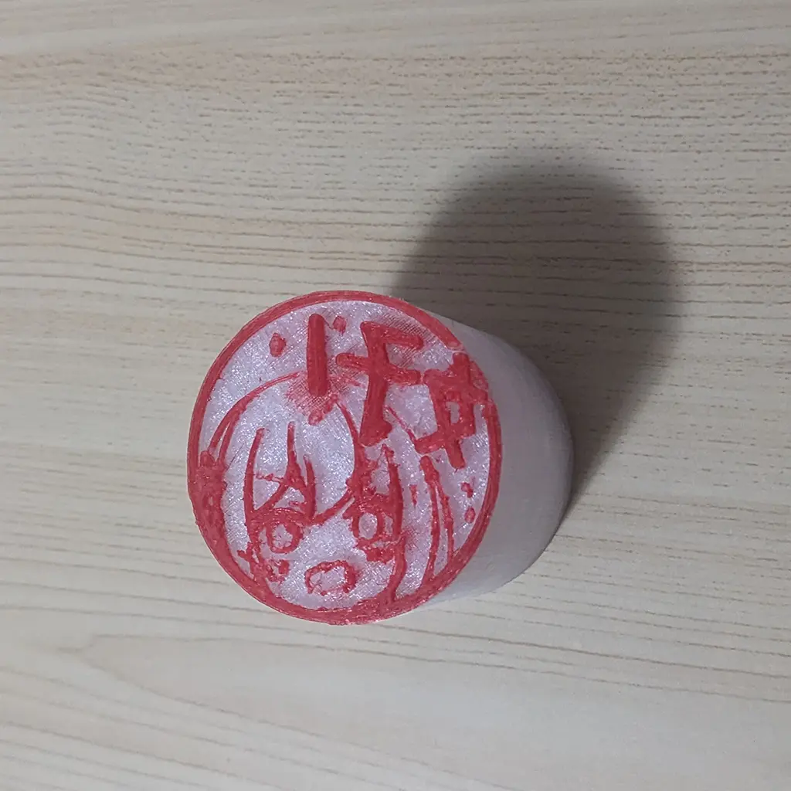
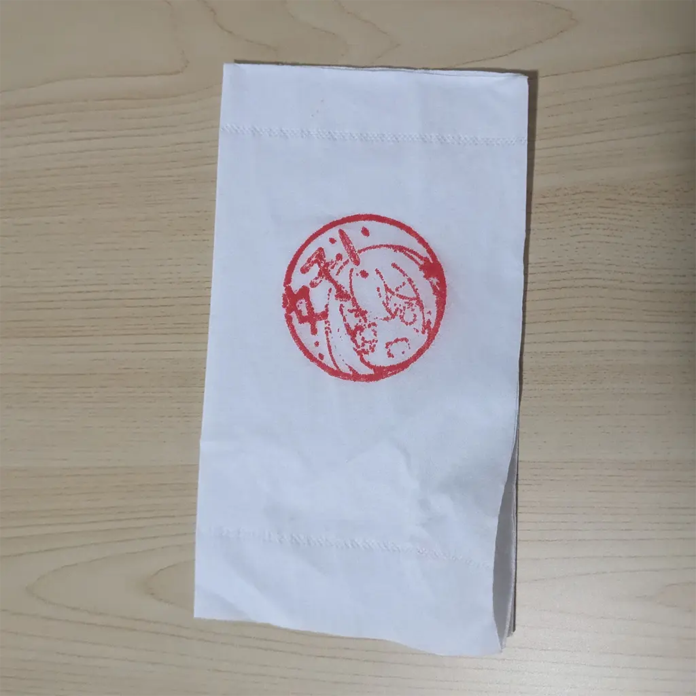

# 印刷术！

大家上中学的时候有刻过橡皮章吗？

橡皮章要自己1下1下刻，很麻烦，而且手会很累！

于是聪明的莉沫酱想到，那不如用3D打印来做印章好了，这样就不用自己刻了！


## 效果

准备1张黑白图像，像是这样:


做成印章以后是这样的:



盖在餐巾纸上试试:



好！


## 使用方法

首先你需要1个Python3，然后用pip安装这个仓库:

```sh
pip install git+https://github.com/RimoChan/seal-sorcery.git
```

安装好之后就可以调用了，使用方法是这样:

```python
from seal_sorcery import seal

mesh = seal('test.png')
mesh.save('test.stl')
```

这样1来你就有1个可以打印的stl文件啦。

其中`seal`方法的参数有这些: 

- `img: Union[np.array, str]`，要刻章的图像，应当是黑白图片。不是的话也没有关系，反正只有第1个通道会用到。
- `长: int = 40`，生成的3D文件的横向尺寸，单位都是毫米。
- `宽: Optional[int] = None`，同上，不过不填的话会根据原图比例自动算出来。
- `印章高度: int = 2`，印章的凸出来的地方的高度。
- `尾部高度: int = 50`，手抓的部分的高度。
- `尾部形状: Literal['凸包', '长方形'] = '凸包'`，印章尾部的形状……嗯，不是很好解释，可以自己试1下！

最后返回的是1个Mesh对象，可以自己调用save方法存到硬盘上。


## 1些问题

- 生成的stl是不是少了1个面？

    对，确实少了1个面。因为我不知道怎么给凹多边形三角剖分。不过好在打印的时候切片软件似乎可以把这个面自动补上，所以就先算了。

- 打印出来不平怎么办？

    买1个贵的打印机……如果不想花钱的话，可以打好之后再把打印机的底座加热到100度，把印章那面用力在上面按几下。或者换TPU材料应该也行，不过我没试过。

- 印泥怎么洗掉？

    我也不知道！


## 结束

就这样，我要回去开打印店了，大家88！
